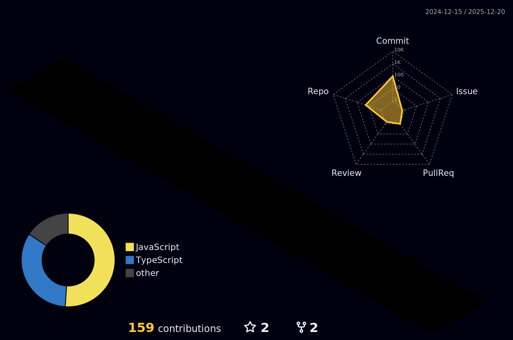

# Krrish Rastogi

  

  

  
  
  

 

   
  <h3>🥇 Winner – Smart India Hackathon 2025 &nbsp; | &nbsp; 🏅 Top 75 – Amazon HackOn'25</h3>
  

    Backend developer specializing in <b>scalable systems</b> and <b>AI integration</b>. 
    Building production-grade solutions with Node.js, TypeScript, PostgreSQL, and Redis. 
    <i>Strong CS fundamentals in DSA, DBMS, OS, and CN.</i>
  

 

## ⚡ Tech Stack

  

 

<h2 align="center">🏙️ GitHub City</h2>

  

 

  Open to backend engineering roles and GenAI collaboration opportunities

